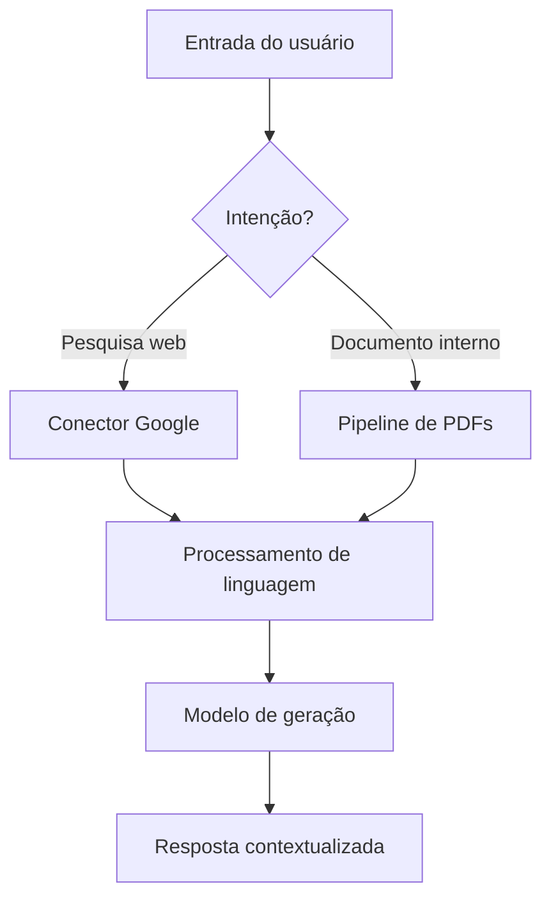

# 🤖 Agente de IA Google


Bem-vindo ao repositório do **Agente de IA Google**, um laboratório aberto para explorar agentes inteligentes capazes de orquestrar buscas, analisar documentos corporativos e responder perguntas em linguagem natural. Aqui você encontra um espaço para experimentar, documentar e compartilhar aprendizados em torno de IA aplicada ao dia a dia.

---

## ✨ Destaques
- **Busca inteligente**: combine a força do Google com técnicas de NLP para encontrar informação de forma contextual.
- **Análise de documentos**: ingestão, limpeza e sumarização de PDFs corporativos para acelerar a tomada de decisões.
- **Assistente conversacional**: interface orientada a perguntas e respostas com memória curta para diálogos mais naturais.
- **Infraestrutura reprodutível**: notebooks e scripts versionados para facilitar a colaboração entre times.

---

## 🧠 Arquitetura em alto nível


Essa arquitetura modular permite combinar dados externos com fontes internas, mantendo controle sobre qualidade e segurança da informação.

---

## 🚀 Como começar
1. Clone o repositório:
   ```bash
   git clone https://github.com/seu-usuario/Agente-de-IA-Google.git
   cd Agente-de-IA-Google
   ```
2. Crie e ative um ambiente virtual:
   ```bash
   python -m venv .venv
   source .venv/bin/activate  # Linux/Mac
   .venv\Scripts\activate     # Windows
   ```
3. Instale as dependências (ajuste conforme seu arquivo `requirements.txt` ou `pyproject.toml`):
   ```bash
   pip install -r requirements.txt
   ```
4. Explore o notebook principal:
   ```bash
   jupyter notebook agente.ipynb
   ```

---

## 🛠️ Stack sugerida
- **Linguagem**: Python 3.10+
- **Frameworks de IA**: LangChain, OpenAI API, Hugging Face Transformers
- **Busca**: Google Custom Search API, SerpAPI
- **Persistência**: SQLite ou PostgreSQL
- **Visualização**: Streamlit para prototipagem rápida

---

## 📚 Recursos para estudo
- [Guia de Engenharia de Prompt](https://platform.openai.com/docs/guides/prompt-engineering)
- [Documentação do LangChain](https://python.langchain.com/docs/get_started/introduction)
- [Boas práticas de agentes conversacionais](https://learn.microsoft.com/azure/ai-services/openai/concepts/use-case-ideas)

---

## 🗺️ Roadmap sugerido
- [ ] Configurar variáveis de ambiente e segredos
- [ ] Integrar conectores externos (Google, Slack, Notion)
- [ ] Implementar fila de tarefas para processamento assíncrono
- [ ] Criar painel de monitoramento com métricas de uso
- [ ] Publicar uma demo interativa

---

## 🤝 Como contribuir
1. Faça um fork do projeto.
2. Crie uma branch para sua feature ou correção.
3. Abra um Pull Request descrevendo a motivação e as mudanças realizadas.
4. Respeite os padrões de commit e formatação definidos pelo time.

Sugestões de melhoria, documentação adicional e exemplos práticos são sempre bem-vindos!

---

## 📄 Licença
Este projeto está sob a licença MIT. Consulte o arquivo `LICENSE` (quando disponível) para mais detalhes.

---

## 🙏 Agradecimentos
Este projeto foi inspirado pelos desafios e aprendizados compartilhados na **Imersão Alura**.
